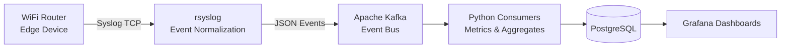

# 📡 LogWeave — Home Network Observability Pipeline

**LogWeave** is a **real-time network observability pipeline** that converts raw **router syslogs** into **structured events, metrics, and dashboards**.

It treats a consumer WiFi router as an **edge telemetry device**, processes its logs as streaming events, and exposes **actionable insights** about network health, stability, and behavior.

No synthetic data.
No mock traffic.
Only real network signals.

---

## ✨ What LogWeave Does

LogWeave provides:

* 📥 **Continuous ingestion** of router logs over TCP
* 🧩 **Rule-based log normalization** into strict JSON events
* 🧵 **Event-stream decoupling** via Kafka
* 📊 **Metric extraction & aggregation**
* 📈 **Network observability dashboards**

The system is designed to mirror **enterprise-grade log pipelines**, applied to a home network.

---

## 🧠 Core Capabilities

### 1. Edge Telemetry Ingestion

* Consumes syslog events directly from a WiFi router
* Supports high-frequency, bursty log traffic
* Preserves timestamps, host identity, and severity

### 2. Structured Event Modeling

* Converts unstructured log lines into schema-consistent JSON
* Categorizes events by protocol and intent:

  * DHCP / DHCPv6
  * SLAAC / Router Advertisements
  * WiFi association & disassociation
  * WAN state changes
  * Error & warning signals

### 3. Event Streaming Backbone

* Kafka acts as the central event bus
* Topics are organized by **event domain**
* Enables independent consumers for analytics, storage, and monitoring

### 4. Metrics & Observability

* Derives metrics such as:

  * WiFi stability and churn
  * Network availability windows
  * Error and warning rates
  * Protocol-level activity trends
* Exposes insights via Grafana dashboards

---

## 🧱 System Architecture

**Design principle:**
Logs are treated as **events**, not files.

---

## 🛠 Technology Stack

| Layer         | Technology           | Role                               |
| ------------- | -------------------- | ---------------------------------- |
| Edge Source   | Consumer WiFi Router | Network telemetry                  |
| Ingestion     | rsyslog              | Parsing, enrichment, JSON emission |
| Streaming     | Apache Kafka         | Event buffering & decoupling       |
| Processing    | Python               | Metric extraction                  |
| Storage       | PostgreSQL           | Aggregates & time-series           |
| Visualization | Grafana              | Observability dashboards           |
| Deployment    | Docker               | Reproducible environment           |

---

## 📊 Observability Outputs

LogWeave exposes insights such as:

* 📶 **WiFi Stability Over Time**
* 🔁 **DHCP / DHCPv6 Activity Trends**
* 🌐 **WAN Uptime & Connectivity Gaps**
* ⚠️ **Error & Warning Spikes**
* 🕒 **Peak Network Usage Windows**

These dashboards resemble **ISP or NOC-level monitoring**, applied at a personal scale.
